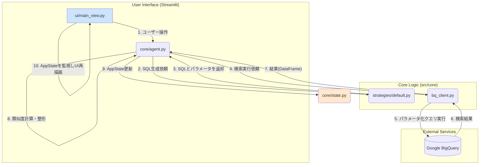

# PatentFinder 3.2 設計・実装ガイド (2025/07/27改訂版 v3)

## 1. 概要と設計思想

### 1.1. プロジェクト目的
本プロジェクトの目的は、AIとの対話を通じて、特許調査の専門家でなくても高品質な調査を可能にする、インタラクティブなWebアプリケーションを構築することである。v3.1のコマンドラインツールで培った検索ロジックを基盤とし、UI/UXを刷新することで、より直感的で効率的な調査体験を提供する。

### 1.2. 設計原則
開発初期の経験から、以下の3つを本プロジェクトにおける不変の中核的設計原則とする。

1.  **関心の分離 (Separation of Concerns)**:
    -   **UI (Presentation Layer)** と **ビジネスロジック (Business Logic Layer)** を厳格に分離する。UIの変更がロジックに影響を与えず、その逆もまた然り、という状態を維持する。これにより、各層の独立した開発とテストが可能になり、保守性が飛躍的に向上する。

2.  **テスト可能性 (Testability)**:
    -   すべてのコアロジックは、UIを介さずに単体でテスト可能でなければならない。具体的な実装として、依存性の注入 (Dependency Injection) パターンを積極的に採用し、外部サービス（DB、LLM API）や設定値をモックに差し替えられるように設計する。

3.  **拡張性 (Extensibility)**:
    -   将来的な機能追加（例: 新しい検索戦略、分析機能、レポート形式）を容易にするため、拡張を前提とした設計パターンを採用する。特に、検索ロジックの中核には**ストラテジーパターン**を導入し、新しい検索アルゴリズムを容易に追加・置換できるようにする。

---

## 2. アーキテクチャ全体像

### 2.1. ディレクトリ構造と責務
```
.
├── .streamlit/
│   └── config.toml      # Streamlit固有の設定
├── docs/                  # プロジェクトドキュメント
├── src/                   # ソースコード
│   ├── app.py             # ★ エントリポイント
│   ├── core/              # ★ ビジネスロジック層
│   │   ├── agent.py       #  └ ワークフロー管理
│   │   ├── bq_client.py   #  └ データアクセス
│   │   ├── state.py       #  └ 状態管理
│   │   └── strategies/    #  └ SQL生成戦略
│   └── ui/                # ★ プレゼンテーション層
│       ├── sidebar.py     #  └ サイドバーUI
│       └── main_view.py   #  └ メイン画面UI
├── tests/                 # ★ テストコード
│   ├── test_sql_search_logic.py # コアロジックの単体テスト
│   └── ...
└── requirements.txt       # 依存パッケージ
```

### 2.2. システム構成図とデータフロー


---

## 3. 実装詳細ガイド

このセクションでは、主要なコンポーネントの具体的な実装方法と設計の意図を解説する。

### 3.1. 状態管理: `src/core/state.py`
Streamlitアプリケーションでは、再実行のたびにスクリプトが上から下まで実行されるため、状態の保持が不可欠である。

-   **`AppState` データクラス**:
    -   アプリケーション全体のセッション状態を保持する唯一の信頼できる情報源 (Single Source of Truth)。
    -   `st.session_state.app_state` というキーでStreamlitのセッションに格納される。
    -   `chat_history`, `search_conditions`, `search_results` など、UIとロジックで共有される全てのデータを属性として持つ。
-   **`SearchConditions` データクラス**:
    -   キーワード、IPC、対象国、期間など、ユーザーが設定した全ての検索条件を構造化して保持する。
    -   `AppState` の属性としてネストされる。これにより、`AppState` が肥大化するのを防ぎ、検索条件関連のデータを論理的にグループ化する。

### 3.2. UI層: `src/ui/`
UI層の責務は「状態の表示」と「ユーザー入力の受付」のみに限定される。

-   **`main_view.py`**:
    -   `AppState` を引数として受け取り、その内容に基づいて現在の画面を描画する。
    -   `st.button`, `st.text_input` などのUIウィジェットが操作された場合、その結果を引数として `core` 層の関数（主に `agent.py` 内の関数）を呼び出す。**UIコンポーネント自身は、ボタンが押された後に何が起こるかの詳細なロジックを知らない。**
    -   **例**: `if st.button("検索実行"): st.session_state.app_state = agent.run_search(app_state)` のように、`agent` に処理を委譲し、返ってきた新しい `AppState` でセッション状態を更新する。

### 3.3. エージェント層: `src/core/agent.py`
UIからのリクエストを受け取り、複数の `core` コンポーネントを協調させて一連のビジネスロジック（ワークフロー）を実行するオーケストレーター。

-   **`run_search()` ワークフロー**:
    1.  **事前検証**: `SearchConditions` に有効な条件が設定されているか検証する。
    2.  **SQL生成**: `SubjectPredicateStrategy` を呼び出し、現在の検索条件からSQLとパラメータを取得する。
    3.  **検索実行**: `bq_client.execute_query()` を呼び出し、データベース検索を実行する。この際、`try-except` ブロックで `BQClientError` を捕捉し、UIに表示するためのエラーメッセージを `AppState` にセットする。
    4.  **後処理**: 検索結果が空でなければ、LLM APIを呼び出して調査テーマとの類似度を計算し、結果をランキングする。
    5.  **状態更新**: 最終的な検索結果や生成されたSQL、エラーメッセージなどを `AppState` オブジェクトに格納し、呼び出し元（UI）に返す。

### 3.4. SQL戦略層: `src/core/strategies/`
検索クエリを生成するロジックをカプセル化し、交換可能にするための層。

-   **ストラテジーパターン**:
    -   `base.py`: 全ての戦略が従うべきインターフェース（`generate_sql`メソッド）を定義した抽象基底クラス `BaseStrategy` が存在する。
    -   `default.py`: `BaseStrategy` を継承した具体的な戦略クラス `SubjectPredicateStrategy` を実装。
-   **`generate_sql()` の実装**:
    -   `SearchConditions` オブジェクトを受け取り、条件の有無をチェックしながら動的に `WHERE` 句を構築する。
    -   SQLインジェクションを防ぐため、値は全て `@` 付きのプレースホルダーとしてSQL文字列に埋め込み、実際の値は `google-cloud-bigquery` のパラメータオブジェクト（`ScalarQueryParameter`, `ArrayQueryParameter`）のリストとして別途生成する。
    -   **特に `IN UNNEST(@countries)` のような配列を扱う条件では、`ArrayQueryParameter` を正しく使用することが不可欠である。**

### 3.5. データアクセス層: `src/core/bq_client.py`
データベース（BigQuery）との通信に関する全ての処理を隠蔽する。

-   **`execute_query()` 関数**:
    -   SQL文字列、パラメータのリスト、そして**認証情報 (`credentials_info`)** を引数として受け取る。
    -   認証情報が引数で渡されなかった場合にのみ、`streamlit` のインポートを試み、`st.session_state` から取得しようとする。この遅延インポートと条件分岐が、テスト環境とStreamlit環境の両方での動作を可能にする鍵である。
    -   `google.cloud.bigquery.Client` を初期化し、`client.query()` を実行する。
    -   APIからの例外は全て捕捉し、原因究明に役立つ詳細なメッセージを含んだ `BQClientError` として再送出する。

### 3.6. テスト: `tests/`
コアロジックの品質を保証するための重要なコンポーネント。

-   **`test_sql_search_logic.py`**:
    -   UIやLLM APIに依存せず、SQL生成からDB検索までのコアなロジックのみを検証することを目的とする。
    -   `config.json` からGCP認証情報を読み込み、ハードコードされたテスト用の `SearchConditions` を使って `agent` や `bq_client` を直接呼び出す。
    -   コアロジックに修正を加えた際は、まずこのテストを実行することで、デグレード（意図しない機能の劣化）が発生していないかを迅速に確認できる。

---

## 4. 開発タスク一覧とロードマップ

### 完了済みタスク (v3.2)
-   [x] **基盤設計とUIモックアップ**: プロジェクト構造の確立と、基本的な3カラムレイアウトの実装。
-   [x] **対話型検索フローの実装**: LLMによる調査テーマの具体化と、検索キーワード・IPCの提案機能。
-   [x] **検索実行とロジック安定化**: 詳細検索UIの追加、類似度ランキングの実装、そして本ガイドで詳述した**SQL検索ロジックの全面的なデバッグとリファクタリング**。

### 今後の開発ロードマップ
-   [ ] **Task 4.1: 検索履歴の蓄積・再利用機能**
    -   **目的**: 過去に実行した検索の条件や結果を保存し、いつでも参照・再実行できるようにする。
    -   **実装案**: 検索成功時に `SearchConditions` と結果概要をJSONファイル等に保存。サイドバーに履歴リストを表示し、選択すると `AppState` を復元する。

-   [ ] **Task 4.2: 結果の可視化機能の実装**
    -   **目的**: 検索結果を多角的に分析し、ユーザーの洞察を深める。
    -   **実装案**: `src/core/visualize.py` を新設し、`plotly` を用いて出願人ランキング等のグラフを生成。`main_view.py` の「分析」タブに表示する。

-   [ ] **Task 4.3: AIによる要約レポート生成**
    -   **目的**: ユーザーが選択した複数特許の要点を抽出し、レポート作成を効率化する。
    -   **実装案**: `src/core/reporter.py` を新設。選択された特許群の情報をLLMに渡し、共通点や特徴をまとめたサマリーを生成させる。

-   [ ] **Task 4.4: `pytest`の導入とテストの自動化**
    -   **目的**: 手動でのスクリプト実行から脱却し、継続的インテグレーション（CI）への道を開く。
    -   **実装案**: `pytest` を導入し、`test_sql_search_logic.py` をリファクタリング。正常系・異常系のテストケースを拡充し、GitHub Actionsでの自動実行を目指す。