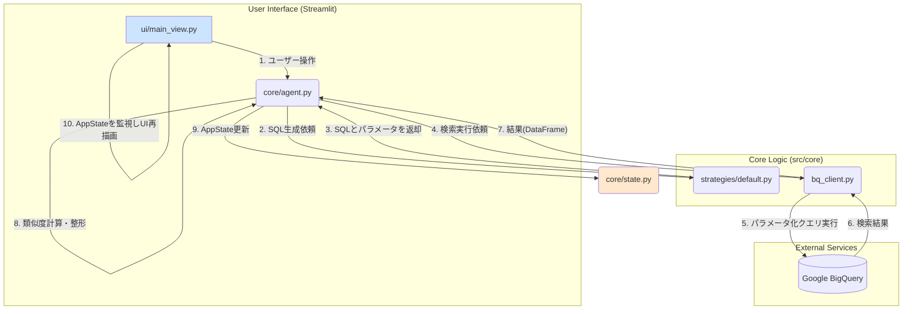

# PatentFinder 3.2 設計・実装ガイド (v3)

## 1. 開発の歩みと設計思想

### 1.1. プロジェクトの黎明期と課題
本プロジェクトは、v3.1で実現したコマンドラインベースの高度な特許検索能力を、より多くのユーザーが直感的に利用できるWebアプリケーションへと昇華させることを目的に始動した。

開発初期段階では、Streamlitの迅速なプロトタイピング能力を最大限に活用し、UIとビジネスロジックを一体的に実装した。しかし、このアプローチはすぐに壁に突き当たることになる。BigQueryへの検索クエリが複雑化するにつれ、UI上では追跡しきれないSQLエラーが頻発。エラーメッセージはStreamlitの実行プロセスに隠蔽されがちで、根本原因の特定にはUIを介した時間のかかる手動テストを繰り返す必要があった。

### 1.2. 設計思想の転換：テスト駆動開発へのシフト
この経験から、我々は**「UIとロジックの完全な分離」**という設計原則に立ち返った。そして、この原則を具現化するため、以下の重要な決断を下した。

-   **単体テスト環境の構築**: `tests/` ディレクトリに、UIから完全に独立してSQL検索ロジックを実行できるテストスクリプト (`test_sql_search_logic.py`) を整備した。これにより、開発者はUIの動作を待つことなく、コアロジックの変更を即座に検証できるようになった。
-   **ロジックの抽象化と再利用性の向上**: `src/core/bq_client.py` を改修し、Streamlitのセッション情報 (`st.session_state`) への依存を解消。認証情報を引数として外部から注入できるようにしたことで、テストスクリプトとStreamlitアプリの両方から同じロジックを再利用できるようになった。
-   **構造化されたエラーハンドリング**: `bq_client.py` がエラー発生時に汎用的な `Exception` ではなく、詳細情報を含むカスタム例外 `BQClientError` を送出するように変更。これにより、呼び出し元（UIやテスト）はエラーの種類を判別し、より的確な対応（ユーザーへの通知やロギング）を行えるようになった。

### 1.3. 辿り着いた安定性
この新しい開発アプローチは、直面していた問題を的確に解決に導いた。テストスクリプト上での集中的なデバッグサイクルを通じて、SQLパラメータの型指定誤り (`IN UNNEST`句) や、依存パッケージ不足 (`db-dtypes`) といった複数の問題を迅速に特定・修正。結果として、検索ロジックは大幅に堅牢性を増し、現在の安定したアプリケーションの基盤が築かれた。この一連の経験は、今後の機能追加においても「まずテストを書く」という文化をチームに根付かせる貴重な教訓となった。

---

## 2. アーキテクチャ詳解

### 2.1. システム構成図とデータフロー

**データフロー解説:**
1.  ユーザーがUI上で検索ボタンを押すと、`main_view.py` が `agent.run_search()` を呼び出す。
2.  `agent` は `SubjectPredicateStrategy` を利用して、現在の検索条件からSQLクエリとパラメータリストを生成する。
3.  `agent` は生成されたSQLとパラメータ、そして認証情報を `bq_client.execute_query()` に渡す。
4.  `bq_client` は受け取った情報でBigQueryに接続し、安全なパラメータ化クエリを実行する。
5.  `bq_client` はBigQueryからの結果をPandas DataFrameに変換して `agent` に返す。
6.  `agent` はDataFrameを受け取り、調査テーマとの類似度計算など、追加の処理を行う。
7.  最終的な結果は `state.AppState` オブジェクトに格納される。
8.  Streamlitの仕組みにより、`AppState` の変更が検知され、UIが自動的に再描画されてユーザーに結果が表示される。

---

## 3. 開発タスク一覧とロードマップ

### 完了済みタスク (v3.2)
-   **基盤設計とUIモックアップ**:
    -   [x] プロジェクトのディレクトリ構造を設計・作成。
    -   [x] `requirements.txt` に初期依存パッケージを定義。
    -   [x] `src/core/state.py` に `AppState` データクラスを定義。
    -   [x] `src/app.py` のエントリーポイントと、UIモジュールの呼び出し部分を実装。
    -   [x] `src/ui/` 以下にプレースホルダーUIを配置し、3カラムレイアウトを確立。
-   **対話型検索フローの実装**:
    -   [x] `agent.py` に、ユーザーの入力から調査テーマ候補を生成するLLM連携機能を実装。
    -   [x] `agent.py` に、確定したテーマから検索キーワードとIPCを提案する機能を実装。
    -   [x] `ui/main_view.py` に、LLMが提案したテーマや検索条件をユーザーが選択・編集できるUIを実装。
    -   [x] `core/strategies` にSQL生成の戦略パターン（`base.py`, `default.py`）を導入。
-   **検索実行とロジック安定化**:
    -   [x] `requirements.txt` に `scikit-learn`, `db-dtypes` を追加。
    -   [x] `ui/main_view.py` に期間・国・件数などの詳細検索UIを追加。
    -   [x] `agent.py` の `run_search` に、`st.status`による進行状況表示、Embeddingとコサイン類似度による結果ランキング機能を追加。
    -   [x] `core/bq_client.py` を実装し、BigQueryとの通信をカプセル化。
    -   [x] **SQL検索ロジックのデバッグとリファクタリングを実施（本セッションの主要な成果）**。

### 今後の開発ロードマップ
-   **Task 4.1: 検索履歴の蓄積・再利用機能**
    -   **目的**: 過去に実行した検索の条件や結果を保存し、いつでも参照・再実行できるようにする。これにより、試行錯誤の過程を記録し、調査の再現性を高める。
    -   **実装案**:
        1.  `AppState` に `session_id` のような一意のIDを持たせる。
        2.  検索が成功した際、`SearchConditions` と結果のプレビュー（上位数件の特許番号など）を、`session_id` と紐付けてJSONファイルや軽量DB（SQLiteなど）に保存する。
        3.  サイドバーに「過去の調査履歴」セクションを追加。保存された履歴をリスト表示し、選択すると当時の検索条件や結果を復元できるようにする。
-   **Task 4.2: 結果の可視化機能の実装**
    -   **目的**: 検索結果を多角的に分析し、ユーザーの洞察を深める。
    -   **実装案**: `src/core/visualize.py` を新設。`pandas`と`plotly`ライブラリを活用し、検索結果のDataFrameから「出願人ランキング（棒グラフ）」「技術分野別（IPC）の出願件数（円グラフ）」「出願年次推移（折れ線グラフ）」などを生成する関数を実装する。`main_view.py` に「分析」タブを設け、これらのグラフを表示する。
-   **Task 4.3: AIによる要約レポート生成**
    -   **目的**: ユーザーが注目した複数の特許の要点を抽出し、調査レポート作成の手間を大幅に削減する。
    -   **実装案**: `src/core/reporter.py` を新設。ユーザーが結果一覧からチェックした特許の `publication_number` を受け取り、各特許の要約を結合してLLMに渡す。「これらの特許群に共通する技術的特徴と、それぞれ独自の発明ポイントを箇条書きで報告してください」といったプロンプトで、質の高いサマリーを生成させる。
-   **Task 4.4: `pytest`の導入とテストの自動化**
    -   **目的**: 手動でのスクリプト実行から脱却し、継続的インテグレーション（CI）への道を開く。
    -   **実装案**: `pytest` を `requirements.txt` に追加。`test_sql_search_logic.py` を `pytest` が認識できる形式（関数名を`test_`で始めるなど）にリファクタリングする。正常系テストに加え、「検索条件が空の場合」「不正なIPCが入力された場合」といった異常系のテストケースを拡充する。将来的にはGitHub Actionsと連携し、Pull Requestごとに自動でテストが実行される体制を目指す。
