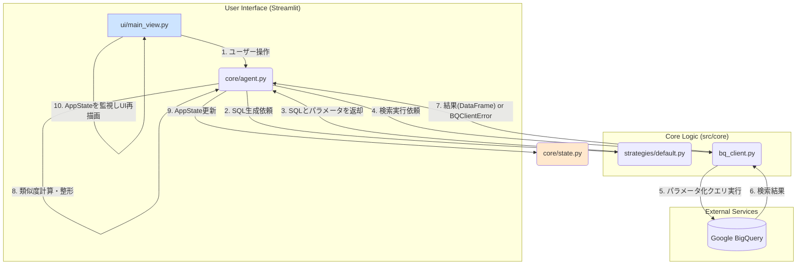

# PatentFinder 3.2 設計・実装ガイド (v4)

## 1. 設計原則

-   **UIとロジックの完全な分離**: StreamlitのUIコード (`src/ui/`) は、表示とユーザー入力の受付に専念する。コアなビジネスロジック (`src/core/`) はUIフレームワークから完全に独立し、テスト可能でなければならない。
-   **テスト可能性 (Testability)**: すべてのコアロジックは、UIを介さずに直接呼び出し、テストできる設計でなければならない。依存性注入（例: `bq_client`への認証情報注入）を積極的に活用する。
-   **拡張性 (Extensibility)**: 新しい機能（特に検索戦略）を追加する際に、既存のコードへの変更が最小限で済むように、ストラテジーパターンなどのデザインパターンを活用する。

## 2. アーキテクチャ

### 2.1. システム構成図とデータフロー

## 3. コンポーネント実装ガイド

-   **`src/core/state.py`**:
    -   **責務**: Streamlitの`st.session_state`に格納される、アプリケーション全体の状態を定義するデータクラス。
    -   **設計意図**: アプリケーションの状態を一元管理する「Single Source of Truth」としての役割を担う。これにより、状態の参照と更新が予測可能になり、コードの見通しが良くなる。

-   **`src/core/agent.py`**:
    -   **責務**: UIからのリクエストを受け取り、LLMとの対話、検索戦略の選択、`bq_client`の呼び出し、結果の加工といった一連のワークフローを統括するオーケストレーター。
    -   **設計意図**: UIとコアロジック（SQL生成、DB接続など）の間に立つ「エージェント」として機能する。UIは「何をしたいか」をエージェントに伝えるだけでよく、具体的な実現方法を知る必要がない。

-   **`src/core/bq_client.py`**:
    -   **責務**: BigQueryへの接続、安全なパラメータ化クエリの実行、結果の取得、そしてエラーハンドリングに特化したクライアント。
    -   **設計意図**: 認証情報を引数として外部から注入できる（依存性注入）設計になっている。これにより、Streamlitのセッション情報に依存せず、テストスクリプトのような外部のプログラムからも容易に再利用できる。エラー発生時には、詳細情報を含むカスタム例外`BQClientError`を送出する。

-   **`src/core/strategies/`**:
    -   **責務**: SQLクエリを生成する具体的なロジックを格納する。
    -   **設計意図**: ストラテジーパターンを採用。すべての戦略は`base.py`の共通インターフェースを実装する。これにより、`agent.py`は具体的なSQL生成ロジックを知ることなく、戦略を動的に切り替えることが可能になる。将来、「類似特許検索戦略」などを追加する際は、このディレクトリに新しいファイルを追加するだけで済む。

-   **`tests/`**:
    -   **責務**: UIから完全に独立して、コアロジックの動作を検証するためのテストスクリプトを格納する。
    -   **設計意図**: プロジェクトの品質保証の要。UI経由では特定が困難なエラー（例: SQL構文エラー）を迅速に発見・修正するためのセーフティネットとして機能する。`pytest`フレームワークとの連携を想定している。

## 4. 開発ロードマップ

### 完了済みタスク
-   **基盤設計とUIモックアップ**
-   **対話型検索フローの実装**
-   **検索実行とロジック安定化**

### 今後の開発タスク
-   **Task 1: 結果の可視化機能の実装**
    -   **目的**: 検索結果を多角的に分析し、ユーザーの洞察を深める。
    -   **実装案**: `src/core/visualize.py`を新設し、`plotly`を用いて「出願人ランキング」「出願年次推移」などを生成する関数を実装する。
-   **Task 2: AIによる要約レポート生成**
    -   **目的**: ユーザーが注目した複数の特許の要点を抽出し、調査レポート作成の手間を削減する。
    -   **実装案**: `src/core/reporter.py`を新設し、選択された特許情報を元にLLMがサマリーレポートを生成する機能を実装する。
-   **Task 3: 検索履歴の蓄積・再利用機能**
    -   **目的**: 過去の調査を記録し、再現性を高める。
    -   **実装案**: 検索条件と結果の概要を軽量DB（SQLiteなど）に保存し、サイドバーから呼び出せるようにする。
-   **Task 4: `pytest`の導入とテストの自動化**
    -   **目的**: 手動テストから脱却し、CIへの道を開く。
    -   **実装案**: `tests/`内のスクリプトを`pytest`形式にリファクタリングし、正常系・異常系のテストケースを拡充する。
