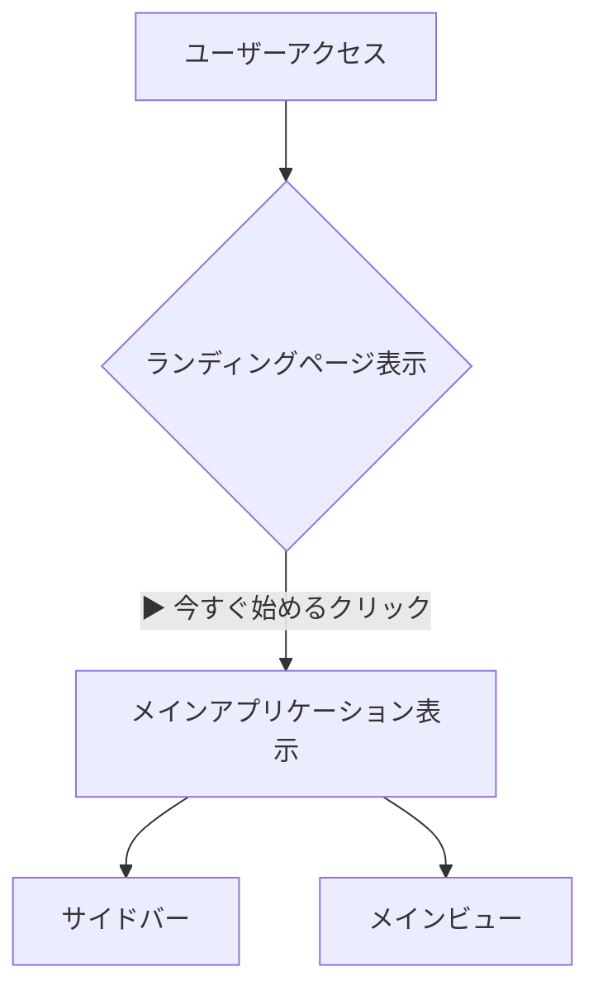
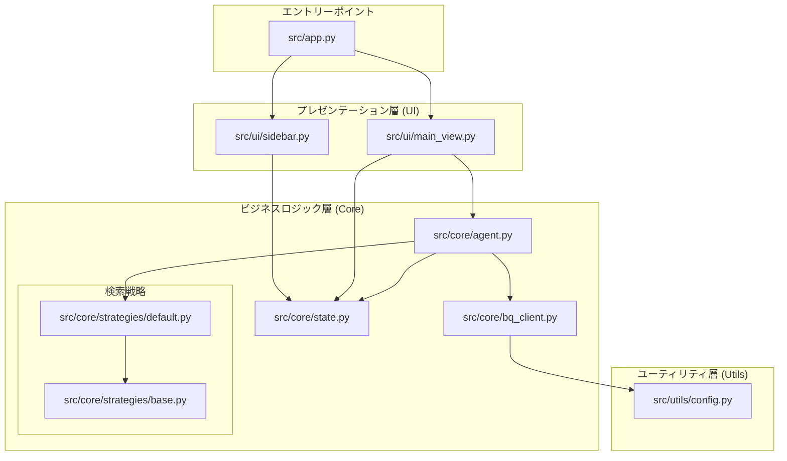

# PatentFinder 3.2 設計・実装ガイド v6

## 1. 設計原則

-   **関心の分離 (SoC)**: UI、ビジネスロジック、データアクセス層を明確に分離し、各コンポーネントが単一の責務を持つように設計する。これにより、保守性とテスト容易性を最大化する。
-   **状態管理の一元化**: Streamlitのセッション状態(`st.session_state`)を唯一の信頼できる情報源（Single Source of Truth）とし、`src/core/state.py` を通じてアクセスすることで、状態の不整合を防ぐ。
-   **拡張性**: 主要な機能、特に検索ロジックはストラテジーパターンを用いて実装し、将来の機能追加が容易に行えるようにする。

## 2. アーキテクチャ

### 画面遷移フロー

### コンポーネント依存関係

## 3. コンポーネント実装ガイド

-   **`src/app.py`**:
    -   **責務**: アプリケーション全体のエントリーポイント。セッション状態(`st.session_state`)を管理し、「ランディングページ」と「メインアプリケーション」のどちらを表示するかを決定する。
    -   **設計意図**: アプリケーションの起動ロジックと状態初期化をこのファイルに集約。`show_landing_page` フラグによって、ユーザーの最初の接点とメイン機能を明確に分離している。

-   **`src/core/state.py`**:
    -   **責務**: アプリケーション全体の状態（検索条件、結果、チャット履歴など）を保持するデータクラスを定義する。
    -   **設計意図**: `st.session_state` に直接文字列キーでアクセスするのを防ぎ、型安全な状態管理を実現する。アプリケーションの状態構造をここで一元管理する。

-   **`src/core/agent.py`**:
    -   **責務**: ユーザー入力の解釈、LLMへの指示、検索戦略の選択、BigQueryの実行といった、一連のビジネスロジックフローを統括するオーケストレーター。
    -   **設計意図**: UIからの要求を受け取り、Core層内の各コンポーネントを協調させてタスクを遂行する「司令塔」。UIはAgentに依頼するだけでよく、複雑なロジックを知る必要がない。

-   **`src/core/bq_client.py`**:
    -   **責務**: Google BigQueryへの接続と、パラメータ化された安全なSQLクエリの実行をカプセル化する。
    -   **設計意図**: 認証情報（サービスアカウントキー）を外部から注入（DI）できる設計にすることで、テスト時にモックのクライアントと差し替えやすくしている。これにより、テスト容易性を高めている。

-   **`src/core/strategies/`**:
    -   **責務**: 様々な検索ロジック（戦略）を実装する。全ての戦略は `base.py` の共通インターフェースを継承する。
    -   **設計意図**: ストラテジーパターンを採用することで、新しい検索アルゴリズムやロジックを「新しい戦略ファイル」として追加するだけで、システム全体に影響を与えずに機能を拡張できる。

-   **`tests/`**:
    -   **責務**: アプリケーションの品質を保証するための自動テストを格納する。特に `test_sql_search_logic.py` は、検索ロジックが期待通りに動作することを検証する。
    -   **設計意図**: `pytest` を実行することで、コード変更が既存機能に悪影響を与えていないか（デグレードしていないか）を迅速に確認できる。CI/CDの基盤となる。

## 4. 開発ロードマップ

### 完了済みタスク
-   **基盤設計とUIモックアップ**: ディレクトリ構造、`state.py`、UI骨格の作成。
-   **ランディングページの実装**: `app.py` を改修し、機能紹介とメインアプリへの遷移ボタンを持つトップページを実装。

### 今後の開発タスク
-   **対話型検索フローの実装**:
    -   **目的**: ユーザーの自然言語入力から、検索条件（キーワード、IPC）をAIが抽出・提案するコア機能の実装。
    -   **実装案**: `agent.py` にLLMを呼び出す関数を作成し、`main_view.py` でその結果をユーザーに提示するUIを構築する。
-   **検索実行と結果の可視化**:
    -   **目的**: 生成されたSQLを実行し、得られた結果をランキング付けして表示する機能の実装。
    -   **実装案**: `agent.py` のワークフローを改修し、BigQuery検索、Embeddingによる類似度計算、結果のソート処理を追加する。
